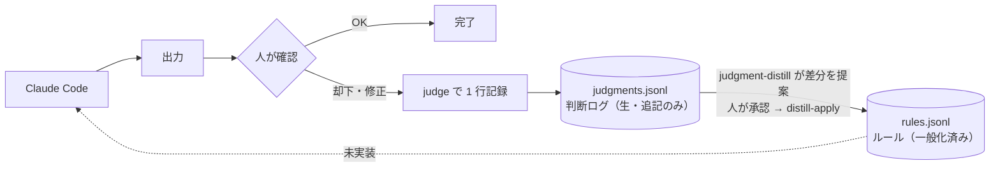

# claude-judgment-loop

[](https://github.com/KazusaNakagawa/claude-judgment-loop/actions/workflows/test.yml)

Claude Code に「それ違う」と言ったときの理由を 1 行ずつログに残し、溜まったログから再利用できる「ルール」を蒸留するための小さな仕組みです。

背景と 3 ヶ月運用した結果は記事に書きました: [Claude Code に「それ違う」と言った 37 回をログにしたら、ルールになったのは 3 つだけだった](TODO: Zenn の記事 URL)

> このリポジトリにあるのは**仕組み**だけです。実際の判断ログとルールは個人的な文脈を含むため公開していません。`examples/` のデータは記事の例をもとにした架空のものです。

## 仕組み



| 層 | 中身 | 性質 |
| --- | --- | --- |
| 判断ログ `judgments.jsonl` | 「何を却下したか・なぜか」の生記録 | 追記のみ。ノイズが多くてよい |
| ルール `rules.jsonl` | ログから一般化した「いつ（`trigger`）・何をするか（`rule`）」 | 人が承認したものだけ。根拠のログ ID（`source_ids`）を必ず持つ |

ルールを Claude Code のセッションに自動で差し込む部分（図の点線）はまだありません。

## 含まれるもの

| パス | 役割 |
| --- | --- |
| `bin/judge` | 記録用の CLI。必須の入力は `--reason` だけ |
| `bin/judge-recall` | `SessionStart` フック。24 時間記録が無ければ記録を、未蒸留のログが溜まっていれば蒸留を、1 日 1 回だけ促す |
| `bin/distill-apply` | 人が承認したパッチを `rules.jsonl` に機械的に当てる。`evidence_count` は `source_ids` から数え直す |
| `skills/judgment-distill/SKILL.md` | ログを読んでルールの差分（NEW / PROMOTE / RETIRE）を**提案するだけ**のスキル |
| `commands/judge.md` | `/judge` スラッシュコマンド |
| `examples/` | 架空のサンプルデータと、`settings.json` / `CLAUDE.md` への追記例 |
| `tests/` | 3 つの CLI の結合テスト |

Python 3.10 以上の標準ライブラリだけで動きます。

## 試す

実データを汚さないよう、一時ディレクトリで動かせます。

```bash
export JUDGMENT_LOOP_DIR="$(mktemp -d)"

bin/judge reject --domain code-review --reason "新機能は実装から入らず、設計ドキュメントを先に起こす"
bin/judge revise --reason "ドキュメントに個人の絶対パスをコミットした" --fix "パスは書かず、ファイルの所在・性質で説明する"
bin/judge stats

# 承認済みのパッチを当てる（ルールの追加 → 根拠の追加 → active に昇格）
bin/distill-apply examples/patch.sample.jsonl
cat "$JUDGMENT_LOOP_DIR/rules.jsonl"
```

データは `$JUDGMENT_LOOP_DIR`（既定は `~/.local/share/judgment-loop/`）に置かれます。設定ファイルを管理しているリポジトリとは分けておくのがおすすめです。

## 導入する

```bash
git clone https://github.com/KazusaNakagawa/claude-judgment-loop.git
cd claude-judgment-loop

mkdir -p ~/.local/bin ~/.claude/skills ~/.claude/commands
ln -s "$PWD"/bin/judge "$PWD"/bin/judge-recall "$PWD"/bin/distill-apply ~/.local/bin/
ln -s "$PWD"/skills/judgment-distill ~/.claude/skills/
ln -s "$PWD"/commands/judge.md ~/.claude/commands/
```

そのうえで、次の 2 つを自分の設定に追記します。

- `examples/settings.json` の `hooks` を `~/.claude/settings.json` に（`~/.local/bin` 以外に置いた場合はパスを直してください）
- `examples/CLAUDE.md` の数行を `~/.claude/CLAUDE.md` に。ルール本体ではなく、「人が却下・修正したときだけ記録する」という仕組みの存在だけを書きます

## 運用のポイント

- **記録するかどうかを決めるのは人。** AI が推測でログを書くと、自分の判断の記録ではなくなります
- **蒸留は提案まで。** スキルは差分を出すだけで、`rules.jsonl` を書き換えるのは `distill-apply` です。AI にファイル全体を書き直させると、関係ないルールが静かに消えることがあるためです
- **`active` にするのは、同じミスが別々に 2 回起きてから。** `distill-apply` は根拠のログの件数しか数えません。1 つの失敗を 2 件に分けて記録すると、件数だけでは 2 回に見えてしまいます
- **読み取り専用のログは寛容に、書き戻すルールは厳格に。** `judge` は壊れた行を飛ばして記録を続けます。`distill-apply` は壊れた行があれば何も書かずに止まり、書き込み前の状態を `rules.jsonl.bak` に残します

## テスト

```bash
python3 -m unittest discover -s tests
```

CI（GitHub Actions）では Python 3.10〜3.13 でテストを流し、上の「試す」の手順もそのまま実行しています。

## License

MIT
